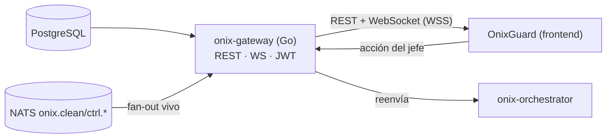

# onix-gateway

**Edge público** que consume el frontend OnixGuard. Escrito en **Go**. Expone **REST + WebSocket + auth JWT**. Lee de PostgreSQL y se suscribe a NATS para empujar el vivo. Sin lógica de negocio pesada.

> **Estado:** se construye en **Fase 1–3**. En Fase 1 empuja la lista de actividad en vivo por WS; en Fase 3 reenvía las acciones del jefe a `onix-orchestrator`. Este README documenta su diseño.

---

## Responsabilidad



## Qué expondrá

- **REST** (ver `onix-contracts/schemas/rest.openapi.yaml`): `/auth/login`, `/api/overview`, `/api/agents`, `/api/stages`, `/api/events` (con filtros), `/api/reports`, `/api/reports/{id}/respond`, `/api/export`, `/healthz`.
- **WebSocket** (`/ws`): mensajes `{type, data}` con `type ∈ {event, metrics, agent_status, report, alert, stage}` (ver `ws.message.schema.json`).
- **Auth:** JWT (access+refresh), contraseñas con argon2, rate-limit en `/auth/login`. Un solo usuario por ahora.

## Contratos

- **Consume:** `CleanEvent` (`onix.clean.*`) y `onix.ctrl.*` para el fan-out en vivo.
- **Lee:** Postgres (esquema de `onix-db`).
- **Reenvía:** acciones del jefe a `onix-orchestrator`.
- **Sirve:** REST + WS al frontend según los contratos.
- **Importa:** `github.com/levapo97-cell/onix-contracts/go/onixcontracts`.

> ⚠️ Rutas long-lived: el WebSocket necesita keepalive/timeout configurados en nginx + Cloudflare (ver `onix-deploy`).

## Estructura (futura)

```text
cmd/onix-gateway/main.go
internal/http/  internal/ws/  internal/auth/  internal/store/
Dockerfile
```

---

*Parte de OnixGuard. Ver el plan en `OnixGuard/docs/PLAN.md` §1, §4 (REST/WS) y §9 (auth).*
